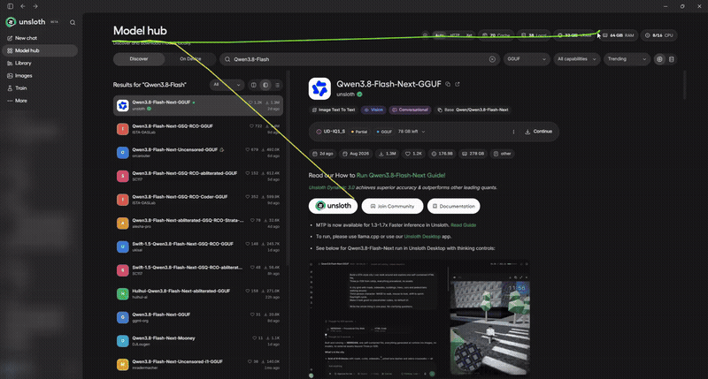
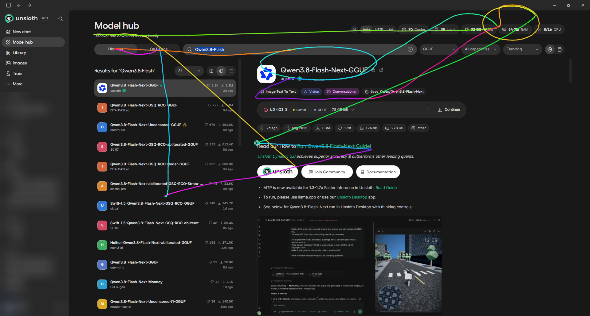

# desktop-navigation

An agent skill for driving and recording native desktop apps (Unsloth Desktop, or any window with no DOM to query) while testing and reviewing Unsloth pull requests.



## What it does

[`claude/skills/desktop-navigation`](claude/skills/desktop-navigation/): screenshots plus real mouse and keyboard input on Windows, macOS and Linux (X11): clicks, keys, typing, window focus, pointing gestures, tours, eased scroll, drag, a cursor trail and screen video for recordings.

## Demo

Recorded on Unsloth Desktop, Windows 11.

- [Every mode in one run, with the cursor trail](docs/media/demo-trail.mp4) (43 s): instant, fast, natural and record moves, underline, hover, circle, tour, highlight, eased scroll, clicks, keys, typing, right-click.
- [Takeover abort](docs/media/takeover-abort.mp4) (17 s): a hand on the mouse mid-gesture stops the run with exit 3 and nothing more is sent.

The trail at the end of the run:



## Installation

```bash
git clone https://github.com/LeoBorcherding/desktop-navigation.git
cd desktop-navigation
# Review this revision before running its helpers.
bash claude/skills/install.sh                          # copies into ~/.claude/skills, existing copies kept
bash claude/skills/install.sh --force desktop-navigation   # replace an installed copy
```

The installer only copies skill folders; it never touches `settings.json`. Start a new agent session afterwards.

## Requirements

Python 3, standard library only. Mouse and keyboard go through each OS's built-in APIs via `ctypes`:

| OS | input | screenshots | optional |
|---|---|---|---|
| Windows | `user32` | `gdi32` | Pillow (faster shots), ffmpeg (video) |
| macOS | CoreGraphics | `screencapture` | needs Accessibility and Screen Recording permission |
| Linux (X11) | Xlib + XTest | scrot, maim, ImageMagick, gnome-screenshot or grim | xdotool / wmctrl, ffmpeg |

## Safety

The skill sends real input. Before each click, key or scroll it checks that the focused target window is still in front and stops (exit 6) if not, and it stops (exit 3) as soon as a person moves the mouse. Run it in a user account or machine you're not using at the same time, and never let it type credentials.

## License

This code is **source available, not open source**. All rights are reserved; see [`LICENSE`](LICENSE).
